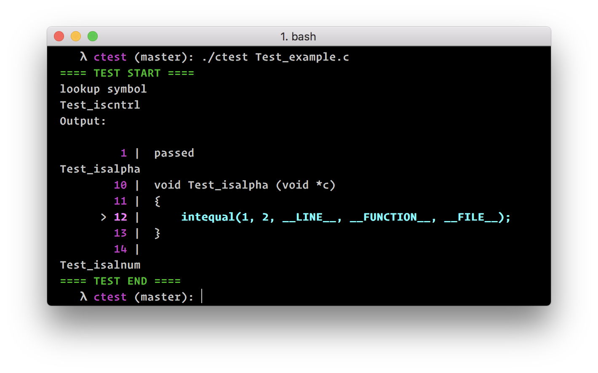

## Ctest

This is a light autotest framwork for c.

## Usage

For Now, You can use it to test a simple c programming. it can not use in a huge project. And it can use to test a part of code.


For Example, my little project [cregex](https://github.com/JesseEisen/cregex). And i can write this test file named: `Test_re.c`

Notice, All the test files need to begin with `Test_` and all the test functions need to begin with `Test_` too.

Here is the test code:

```c
#include "cregex.h"
#include <assert.h>
#include <stdio.h>

#define str "[a-zA-Z, ]*"

void
Test_cregex_match(void)
{
	char *string  = "Hello, Today is 2017/11/27";
	char *pattern = "^" str "([0-9]{4})/([0-9]{2})/([0-9]{2})$";

	cregex_t  reg;
	cregex_init(&reg, 10);
	assert(cregex_match(&reg, pattern, string) != -1);
	cregex_free(&reg);
	printf("pass\n");
}

void
Test_cregex_match_all(void)
{
    char *string2  = "paranormal";
    char *pattern2 = "(a.)";

	cregex_t  reg;
	cregex_init(&reg, 10);
	assert(cregex_match_all(&reg,pattern2,string2) != -1);
	cregex_free(&reg);
	printf("pass\n");
}

```

and the files in the `src` are:

```bash
$ ls
cregex.c cregex.h Test_re.c
```

Now, you just use the `ctest` to run this test just like:

```bash
$ ctest Test_re.c cregex.c
pass
pass
```

Use `gcc ctest.c -o ctest -ldl` to generate the `ctest` binary.


## Assertion and Result

**Just an experiment for Now, So it is hard to use firstly. But, I will improve that soon**

Some assertion functions will add to auto test. Now, the `util.h` and `util.c` are still in progress, As a semifinished product, It only support `int` check, and the output will more specific. Here we go!

First, we compile a dynamic library `libutil.so`

```shell
$ gcc -fPIC -shared util.c -o libutil.so
```

And now just for experiment we need to set `LD_LIBRARY_PATH=.`. Where the path is the path of `libutil.so`. If we do so, we can write this testfile `Test_example.c`

```c
#include <stdio.h>
#include "util.h"

void
Test_isalnum(void *c)
{
}


void Test_isalpha (void *c)
{
    intequal(1, 2, __LINE__, __FUNCTION__, __FILE__);
}


void
   Test_iscntrl     (void *c)
{
    intequal(1, 1, __LINE__, __FUNCTION__, __FILE__);

}

```

Next, we just run:

```shell
$ ctest Test_example.c
```

It will generate this output:




Note: The output is not very pretty, And when i finish this project. It will look good than now.


### License

(MIT)
